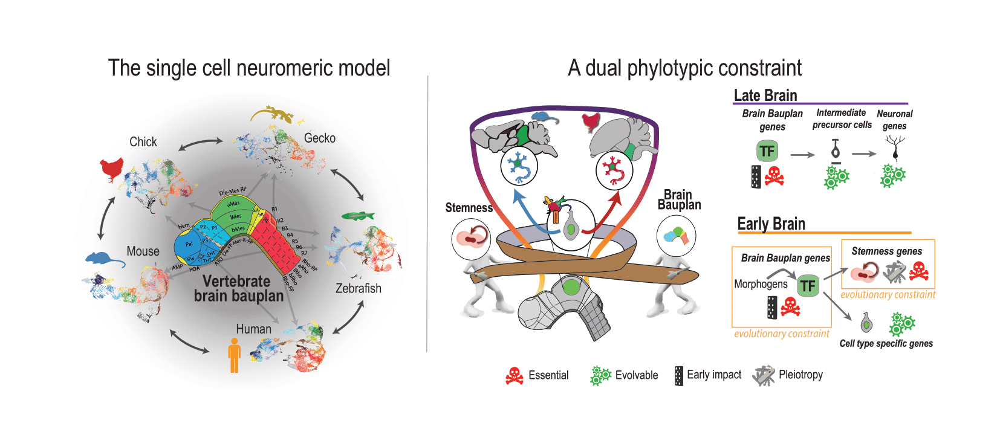

# A dual genetic constraint underlies the conservation of early brains in vertebrates

This repository contains code used in the analysis of the manuscript: "A dual genetic constraint underlies the conservation of early brains in vertebrates" by Rodrigo Senovilla-Ganzo, Christina Bekiari,  Eneritz Rueda-Alaña,  Tetsuya Yamada,  Bastienne Zaremba,  Ana María Aransay,  Laura Escobar,  Mats Nilsson,  Marco Grillo,  Henrik Kaessmann,  Fernando García-Moreno. You can find the manuscript here: https://doi.org/10.1101/2025.10.29.684766

Apart from R Marckdowns and Jupyter Notebooks for reproducing the analysis, you can find the following resources of interest:
- Single cell atlases can be explored in a Shiny app: https://phylobrain.serve.scilifelab.se/app/phylobrain
- Spatial transcriptomic atlas can be explored in TissUUmaps: https://phylochicken.serve.scilifelab.se/#
- Bash for Paroedura picta annotation in GeMoMa.sh
- Functions employed for analyisis are stored in conf.R

Notebooks are attached to reproduce manuscript analysis:
1. scRNAseq_rawData_exploration
2. scRNAseq_neural_exploration
3. scRNAseq_EvoComparisons
4. snATACseq_exploration
5. SCENIC+_proccessing
6. EvoParameters_calculation

Data is stored in EGA (waiting for ID confirmation).
